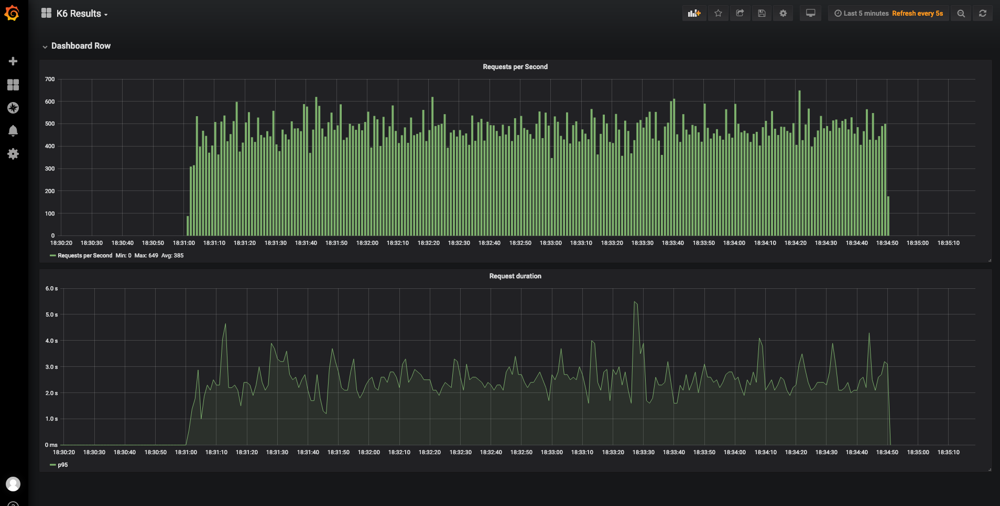

# K6 Grafana Dashboard

## Summary
[K6][1] is a tool that allows to test performance of websites. The
output of this tool can be stored in a [InfluxDB][2] instance and
display this data through a [Grafana][3] dashboard.

This project pretends to increase the scope of its [documentation][4]
covering the installation and integration of the Database and
Dashboard using [Helm][5] charts.

## Virtual Machines

This project uses [Vagrant tool][6] for provisioning Virtual Machines
automatically. The [setup](setup.sh) bash script contains the
Linux instructions to install dependencies and plugins required for
its usage. This script supports two Virtualization technologies
(Libvirt and VirtualBox).

    $ ./setup.sh -p libvirt

Once Vagrant is installed, it's possible to provision a cluster using
the following instructions:

    $ vagrant up

## License

Apache-2.0

[1]: https://k6.io/
[2]: https://www.influxdata.com/
[3]: https://grafana.com/
[4]: https://docs.k6.io/docs/influxdb-grafana
[5]: https://helm.sh/
[6]: https://www.vagrantup.com/
